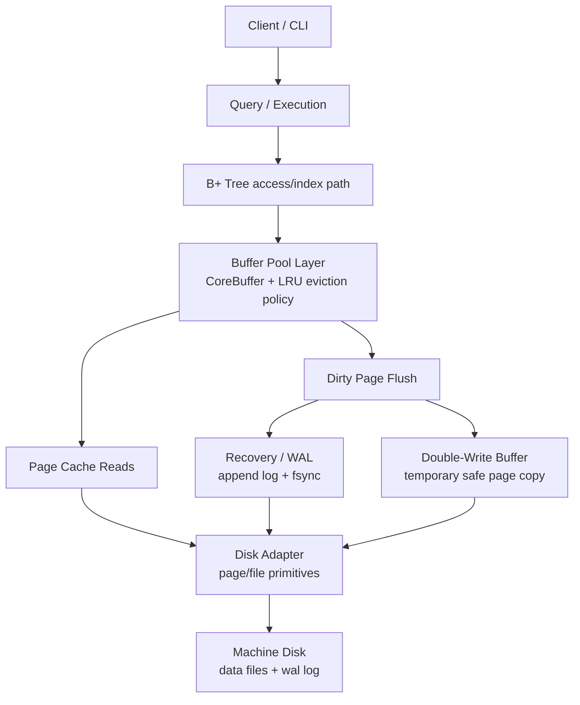
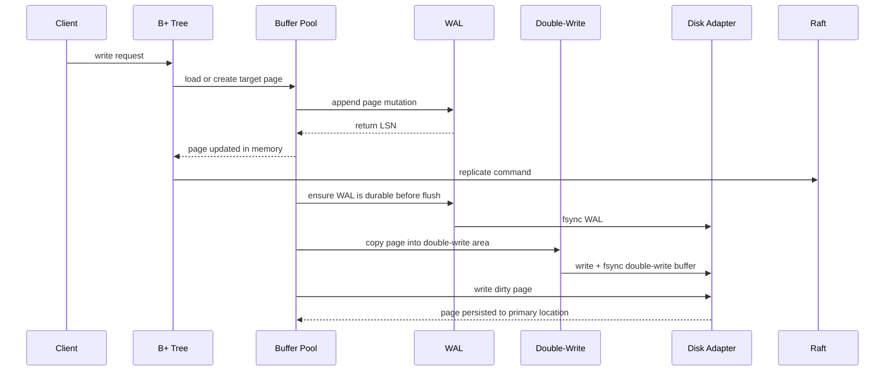
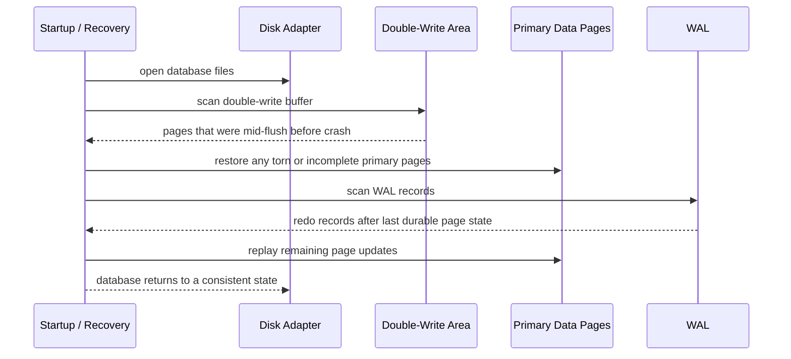
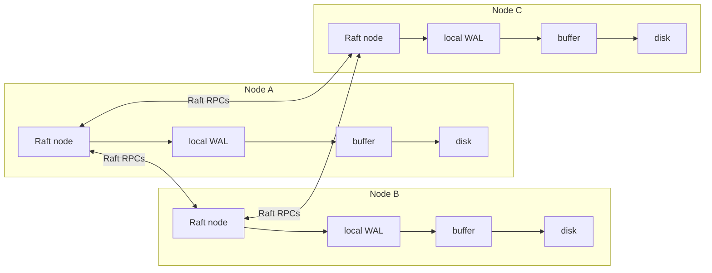

# Cataraft

Cataraft is a simple distributed database project written in Go. The first phase focuses on building a small storage engine with crash recovery and replication primitives rather than a full SQL database.

The initial system is intended to support:

- A B+ tree storage/index structure
- Double-write protection for safer page persistence
- Write-ahead logging (WAL) for crash recovery
- An LRU-managed buffer pool
- Raft consensus for horizontal scaling and replicated state

The short-term target is a minimal but coherent database core that can safely persist data on one node and evolve into a replicated multi-node system.

## High-level Architecture

- The B+ tree never touches the disk adapter directly; it only speaks to the Buffer Pool.
- The WAL and Double-Write Buffer both reach the Disk Adapter but through separate file handles



### Write Path



### Crash Recovery With Double-Write



### Replication View



## Getting Started

```bash
go run ./cmd/cataraft
```

The process expects a data directory through `CATA_DATA`. On Linux, it falls back to `/var/lib/cataraft` when the variable is not set.

```bash
CATA_DATA=/tmp/cataraft go run ./cmd/cataraft
```

## Codex

- [Custom instructions with AGENTS.md](https://developers.openai.com/codex/guides/agents-md)

## References

- [Build Your Own Database From Scratch in Go](https://build-your-own.org/database/)
- [Database Internals](https://www.amazon.com/Database-Internals-Deep-Distributed-Systems/dp/1492040347)
- [Designing Data-Intensive Applications](https://www.amazon.com/Designing-Data-Intensive-Applications-Reliable-Maintainable/dp/1449373321)
- [Raft Consensus Algorithm](https://raft.github.io/)
